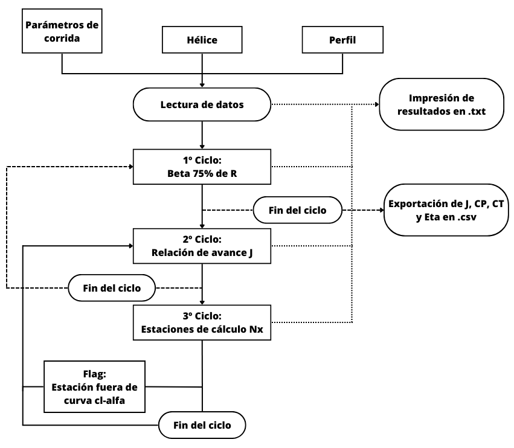
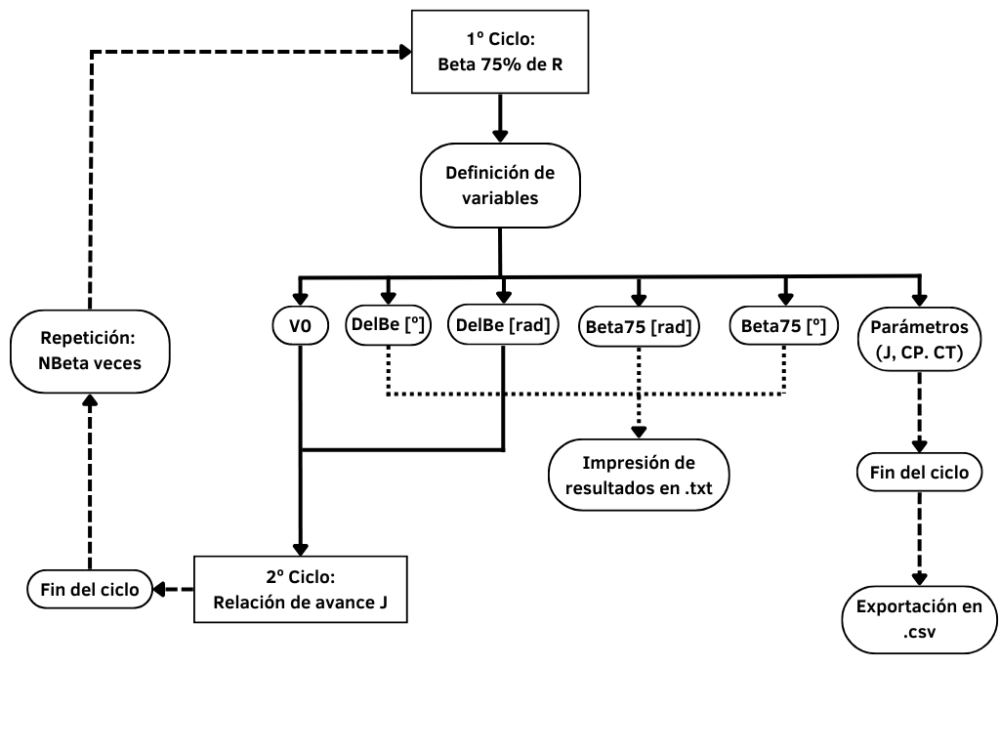
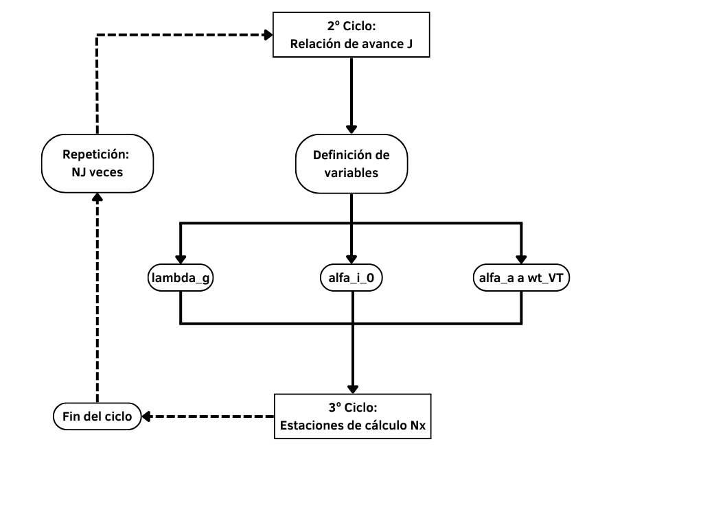

# Aerodinámica II

Repositorio para el desarrollo de los códigos de *helian\.py* y *hover\.py* usados en Aerodinámica II.

Dichos códigos fueron desarrollados originalmente por ex alumnos de la carrera de Ingeniería Aeronáutica en los años 80 en Fortran 77.

En el año 2021 el autor de este repositorio comenzó con la "traducción" a Python. A partir de ello se fueron desarrollando mejoras y optimizaciones generales de los mismos.

## Helian

La herramienta Helian tiene como objetivo el análisis de una hélice para la generación del Gráfico de la Hélice.

- **Flujo Global**: Flujo de cálculo global.
  
- **Primer ciclo**: Recorrido de ángulo de paso.
  
- **Segundo ciclo**: Relación de avance J.
  

## Hover

La herramienta Hover es un software que se originó de una adaptación de Helian para el análisis de un rotor de helicóptero en un estado de vuelo suspendido. (condición de Hover).

- **Flujo**: Flujo global.
  